# Shepherd Model Gateway

**The high-performance inference gateway for production LLM deployments**

Route, balance, and orchestrate traffic across your LLM fleet with enterprise-grade reliability.

[Get Started](getting-started/index.md){ .button .button--primary }
[View on GitHub](https://github.com/lightseekorg/smg){ .button .button--secondary }

70%
TTFT Reduction

<1ms
Routing Latency

40+
Metrics

100%
OpenAI Compatible

Works With

vLLM
SGLang
TensorRT-LLM
OpenAI
Claude
Gemini

---

## Why Shepherd Model Gateway?

SMG sits between your applications and LLM workers, providing a unified control and data plane for managing inference at scale. Whether you're running a single model or orchestrating hundreds of workers across multiple clusters, SMG gives you the tools to do it reliably.

### :material-server-network: Full OpenAI Server Mode

With gRPC workers, SMG becomes a complete OpenAI-compatible server — handling tokenization, chat templates, tool calling, MCP, reasoning loops, and detokenization at the gateway level.

### :material-speedometer: High Performance

Native Rust implementation with gateway-side tokenization caching, token-level streaming, and sub-millisecond routing. Built for throughput at scale.

### :material-shield-check: Enterprise Reliability

Circuit breakers, automatic retries with exponential backoff, rate limiting, and health monitoring. Your inference stack stays up.

### :material-chart-line: Full Observability

40+ Prometheus metrics, OpenTelemetry distributed tracing, and structured logging. Know exactly what's happening.

---

## How It Works

  

### :material-lightning-bolt: gRPC Mode

**Gateway = Full Server**

SMG handles everything: tokenization, chat templates, tool parsing, MCP loops, detokenization, and PD routing. Workers run raw inference on SGLang, vLLM, or TensorRT-LLM.

### :material-swap-horizontal: HTTP Mode

**Gateway = Smart Proxy**

SMG handles routing, load balancing, and failover. Workers run full OpenAI-compatible servers (SGLang, vLLM, TRT-LLM). Supports PD disaggregation.

### :material-cloud-outline: External Mode

**Gateway = Unified Router**

Route to OpenAI, Claude, Gemini through one endpoint. Mix self-hosted and cloud models seamlessly.

---

## Choose Your Path

### :material-rocket-launch: New to SMG?

Start here to understand what SMG does and get it running in minutes.

[Getting Started →](getting-started/index.md)

### :material-book-open-variant: Learn the Concepts

Understand SMG's architecture, routing strategies, and reliability features.

[Read Concepts →](concepts/index.md)

### :material-wrench: Ops Setup

Continue onboarding with monitoring, logging, and TLS guides.

[View Getting Started Guides →](getting-started/index.md)

### :material-api: API Reference

Complete reference for the OpenAI-compatible API and SMG extensions.

[View Reference →](reference/index.md)

:fontawesome-brands-github: [GitHub](https://github.com/lightseekorg/smg) · :fontawesome-brands-slack: [Slack](https://join.slack.com/t/lightseekorg/shared_invite/zt-3py6mpreo-XUGd064dSsWeQizh3YKQrQ) · :fontawesome-brands-discord: [Discord](https://discord.gg/wkQ73CVTvR)

